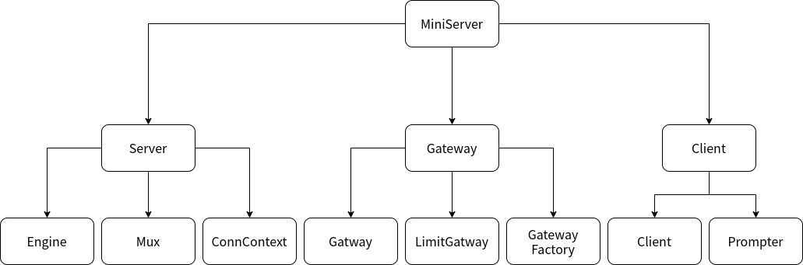
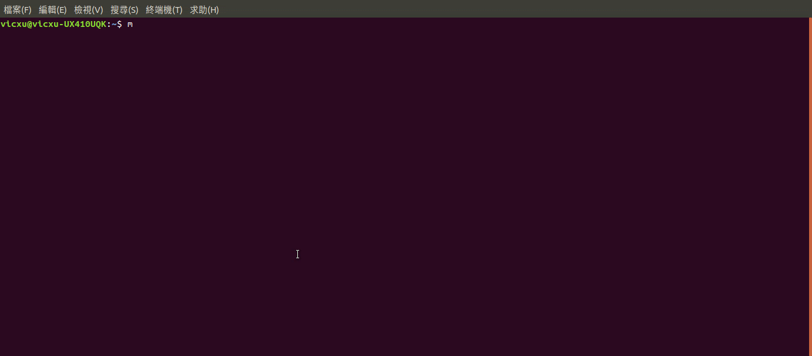

# MiniServer

MiniServer is a demo for the TCP server. The purpose of this project is to practice the socket and concurrency programming.

## Table of Contents

* [Installation](#installation)
* [Usage](#usage)
* [Features](#features)
* [Architecture](#architecture)
* [Demo](#Demo)

### Installation

1.Clone the project to your destination, and ensure your golang version is 1.14+.

    git clone github.com/XuVic/miniserver

2.Compile the MiniServer to $GOPATH/bin folder.

    go build -o $GOPATH/bin miniserver.go

3.Execute `miniserver` command to test the installation.

    miniserver

### Usage

1.Run a MiniServer.

    miniserver run -a=localhost -p=3000

2.Run a Client.

    miniserver client

### Features

#### Alive Connection

The MiniServer can handle multiple requests in one connection. Moreover, connections can be processed simultaneously.

#### Connect to exnternal API

You can build a customized gateway interface to fetch data from an external API. You can also limit the number of requests per second for that gateway.

#### Simple Mux

The Mux handler can serve as a simple router that can be used to route the request and register endpoints.

#### Client Interface

You can run a client application to build connections and send requests.

### Architecture

#### System Layer Diagram

##### Server Package

* **Engine :** Engine is the core component that serves as configuration and management TCP connections.

* **Mux :** Mux is a Handler that will be injected into the Engine. It serves as a router.

* **ConnContext :** ConnContext represents the context of the connection. It can parse the request and instantiate a corresponding response.

##### Gateway Package

* **Gateway :** Gateway an interface regulate the implementation of a gateway of external API.

* **LimitGateway :** LimitGateway is decorator that extends the limit function on regular gateways.

* **GatewayFactory :** GatewayFactory is used to instantiate different gateways. This factory also ensure the gateway is singleton.

##### Client Package

* **Client :** Client is a client-side engine that used to build a connection with a TCP server, send requests and receive responses.

* **Prompter :** Prompter serves as a view object that prompts messages to users and accepts the command from users.

### Demo

